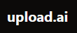
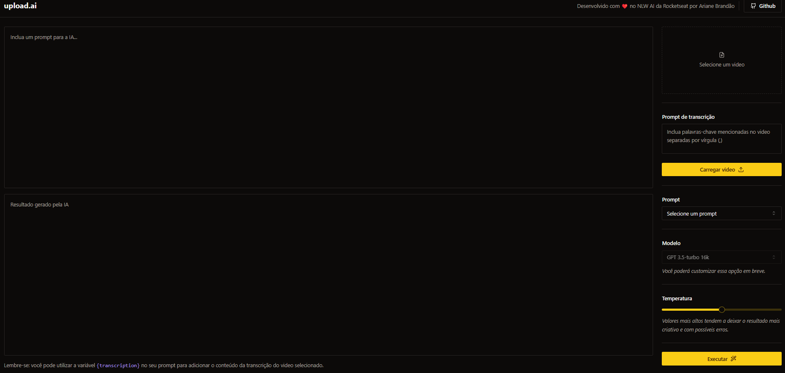

<h1 align="center">
  
</h1>

 

  

## 🚀 NLW 2023 - IA - upload.ia

Esse projeto foi desenvolvido durante a semana do evento [NLW 2023 IA](https://nextlevelweek.com) da RocketSeat.

## 💻 Projeto

Aplicação que possibilita realizar upload de videos e por meio de IA, criar automaticamente títulos chamativos e descrições com um boa indexação.

Esse projeto não está no ar para testes, pois depende da ferramenta paga OpenAI para funcionar.

## Tecnologias

Esse projeto foi desenvolvido com as seguintes tecnologias:

- [React](https://reactjs.org)
- [OpenAI](https://openai.com/)
- [TailwindCSS](https://tailwindcss.com/)
- [TypeScript](https://www.typescriptlang.org/)
- [Vite](https://vitejs.dev)
- [Node](https://nodejs.org/)
- [Axios](https://axios-http.com)

### Como executar

- Clone o repositório

### Como executar o backend

- Entre no diretório `api` com o comando `cd api`, instale as dependências com `npm install`
- Importe as tabelas do SQLite com `npx prisma migrate dev`
- Importe os seeds da tabela com `npx prisma db seed`
- Renomeie o arquivo `.env.example` para `.env`, coloque o valor da sua key da OpenAI em `OPENAI_KEY`
- Inicie o servidor com `npm run dev`

Esse backend irá rodar em localhost:3333 do seu navegador.

### Como executar o frontend

- Entre no diretório `web` com o comando `cd web`, instale as dependências com o comando `yarn`
- Rode a aplicação com `yarn dev`

Agora você pode acessar o link gerado pelo Vite no navegador.

** OBS: Essa aplicação depende do back-end desenvolvido em node estar rodando em localhost:3333.